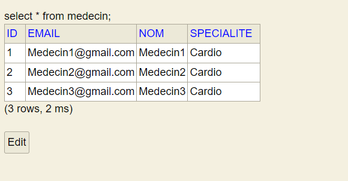

<h3>Compte Rendu 2ème Avtivité (PATIENT-MEDECIN)<h3>
<h4>1-Creation de l'entité Patient</h4>

<h4>2-Creation de l'entité Medecin</h4>

<h4>3-Creation de l'entité Consultation</h4>

<h4>4-Creation de l'entité RDV</h4>

<h4>5-Creation de l'entité StatusRDV</h4>

<h4>6-Creation de Repository Patient</h4>

<h4>7-Creation de Repository Medecin</h4>

<h4>8-Creation de Repository Consultation</h4>

<h4>9-Creation de Repository RDV</h4>

<h4>10-Configuration de fichier application.properties</h4>

<h4>11-Base de données H2</h4>

<h4>12-Opérations de gestion </h4>
<h5>-----Ajouter-----</h5>
<h5>-----PATIENT-----</h5>

<h5>-----MEDECIN-----</h5>

<h5>-----CONSULTATION-----</h5>

<h5>-----RDV-----</h5>

<h5>-----Chercher-----</h5>
<h5>-----PATIENT-----</h5>

<h5>-----MEDECIN-----</h5>

<h4>13- Creation de l'interface IHospitalService</h4>

<h4>14- L'implementation de  l'interface IHospitalService</h4>

<h4>15- Opérations de gestion</h4>
<h5>-----PATIENT-----</h5>

<h5>-----MEDECIN-----</h5>

<h5>-----------------------------</h5>

<h5>-----CONSULTATION-----</h5>

<h5>-----RDV-----</h5>

<h5>-----BD-----</h5>
<h5>-----PATIENT-----</h5>

<h5>-----MEDECIN-----</h5>

<h5>-----CONSULTATION-----</h5>

<h5>-----RDV-----</h5>

